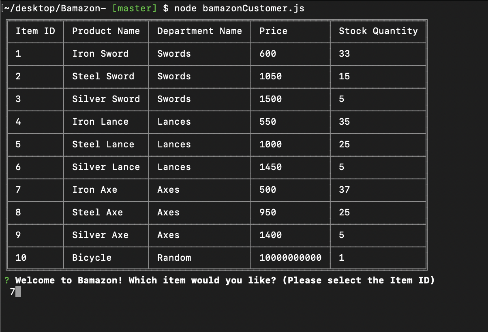
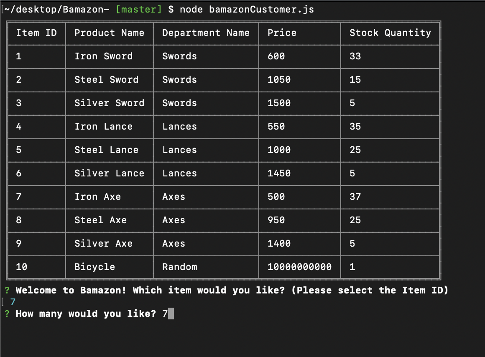
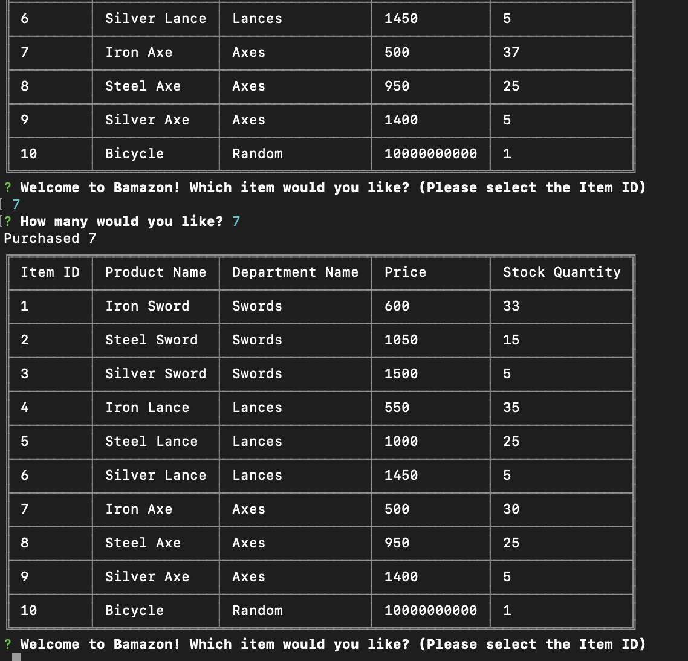
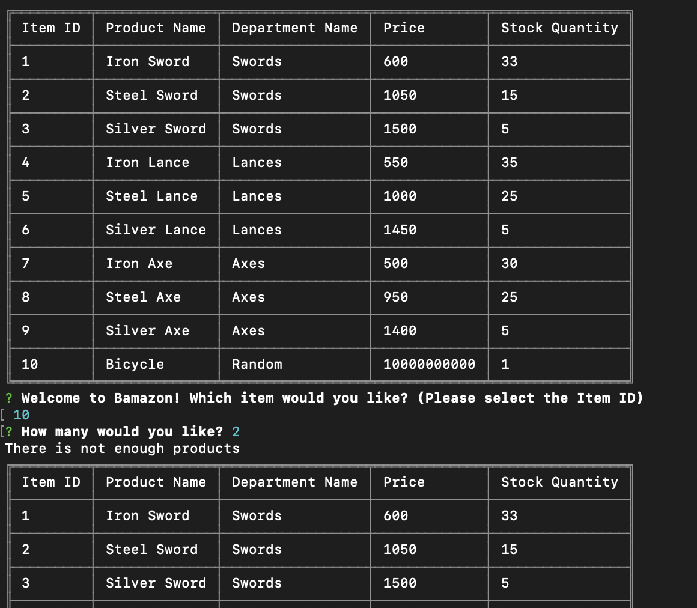

# Bamazon 

## Summary

The Bamazon application updates itself after a user requests how many items they want to purchase.

## How Bamazon Works



When you start the application, the table will be shown first with the questions below it.



Once you answer the first question, the second question will pop up.



After the user types in how many of a certain item they would like to purchase, the table will reppear with an updated quantity number. Notice how in row 7 for "Iron Axe", the number has been changed from 37 to 30.



If a user requests an item quantity great than what is available, a message will pop up saying that "there is not enough products".


## Technologies Used

Node.js - Javascript that is necessary to run outside of the browser. 

NPM - NPM was used to install packages for mysql, inquirer, and cli-table. Mysql allows the file to read the data contained in a sql file. Inquirer creates the prompts that asks users questions. Cli-table is used to create the table to display the products. 

MySQL - Stores data in a table and is able to update when a user purchases a number of items.

## Improvements and Future Development

1) I would like to add are messages telling the user that if they pressed a wrong button (for example a letter instead of a number representing the item ID), the user will be given a message and the application will go back to the starting question.

2) When the user purchases an item or items, the current message is "Purchased (number of items)" In future updates, I would like it so that the message has more clarity in saying the name of the item that was purchased and the total cost.

## Challenges and Code Snippet

One of the biggest challenges to this project was updating the quantity for each item after a certain amount was purchased. While the idea is straight forward, executing and building this function was no easy task. 

First we have the "connection.query" which allows terminal to scan mysql and get the data needed. Next, the conditionals state that if the user requests an amount of a certain item that is larger than the actual quantity, the user will be given a message stating that there are no more products. 

Otherwise, the table will update itself with the new quantity of the recently purchased item and the user will see a message the amount of items they purchased. 

``` javascript

function updateQuantity(product_id, product_quantity) {
    connection.query("SELECT * FROM products WHERE item_id =?", [product_id],
        function (err, res) {
            if (err) throw err;
            if (product_quantity > res[0].stock_quantity) {
                console.log("There is not enough products")
                afterConnection()
            }
            else {

                var newQuantity = res[0].stock_quantity - product_quantity
                connection.query(
                    "UPDATE products SET ? WHERE ?",
                    [
                        {
                            stock_quantity: newQuantity
                        },
                        {
                            item_id: product_id
                        }
                    ]
                )
                console.log("Purchased " + product_quantity)
                afterConnection()
            }
        })


